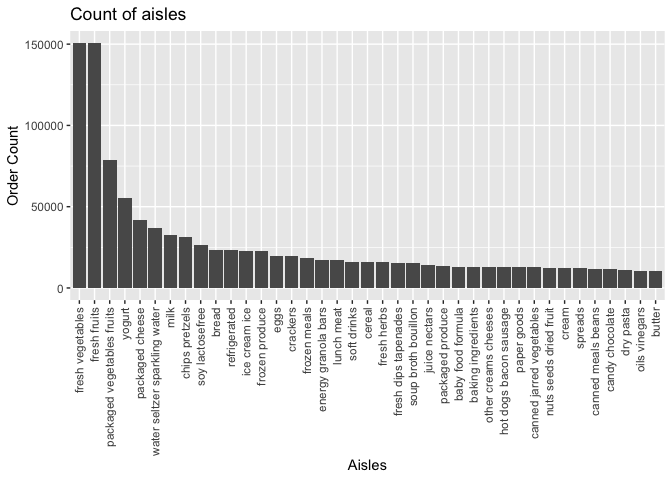

P8105\_HW3\_zc2555
================
Ziyu Chen
10/18/2021

*r setup & loading packages*

``` r
library(p8105.datasets)
data("instacart")
library(tidyverse)
```

    ## ── Attaching packages ─────────────────────────────────────── tidyverse 1.3.1 ──

    ## ✓ ggplot2 3.3.5     ✓ purrr   0.3.4
    ## ✓ tibble  3.1.4     ✓ dplyr   1.0.7
    ## ✓ tidyr   1.1.3     ✓ stringr 1.4.0
    ## ✓ readr   2.0.1     ✓ forcats 0.5.1

    ## ── Conflicts ────────────────────────────────────────── tidyverse_conflicts() ──
    ## x dplyr::filter() masks stats::filter()
    ## x dplyr::lag()    masks stats::lag()

``` r
library(ggplot2)
library(dplyr)
```

\#Problem 1

*Q1: How many aisles are there, and which aisles are the most items
ordered from?*

``` r
aisles_count =
  instacart %>%
  count(aisle, sort=TRUE)

aisles_count
```

    ## # A tibble: 134 × 2
    ##    aisle                              n
    ##    <chr>                          <int>
    ##  1 fresh vegetables              150609
    ##  2 fresh fruits                  150473
    ##  3 packaged vegetables fruits     78493
    ##  4 yogurt                         55240
    ##  5 packaged cheese                41699
    ##  6 water seltzer sparkling water  36617
    ##  7 milk                           32644
    ##  8 chips pretzels                 31269
    ##  9 soy lactosefree                26240
    ## 10 bread                          23635
    ## # … with 124 more rows

There are 134 aisles in the instacart dataset, fresh vegatables have the
most times, which is 150609.

*Q2: Make a plot that shows the number of items ordered in each aisle,
limiting this to aisles with more than 10000 items ordered. Arrange
aisles sensibly, and organize your plot so others can read it*

``` r
aisle_count = instacart %>%
  count(aisle,sort=TRUE) %>%
  filter(n>10000)

ggplot(aisle_count,aes(x=reorder(aisle, -n),y=n))+
  geom_bar(stat='identity')+
  theme(axis.text.x = element_text(angle = 90, vjust = 0.5, hjust=1))+
  labs(title="Count of aisles")+
  xlab("Aisles")+
  ylab("Order Count")
```

<!-- -->

The top three aisles are fresh vegetables, fresh furit and packaged
vegetables fruit.

*Q3: Make a table showing the three most popular items*

``` r
instacart %>%
  filter(aisle %in% c("baking ingredients", "dog food care", "packaged vegetables fruits")) %>%
  group_by(aisle, product_name) %>%
  summarise(
    product_count = n()) %>%
  mutate(
    product_rank = min_rank(-product_count)) %>%
  filter(product_rank <=3) %>%
  select(-product_rank) %>%
  knitr::kable()
```

    ## `summarise()` has grouped output by 'aisle'. You can override using the `.groups` argument.

| aisle                      | product\_name                                 | product\_count |
|:---------------------------|:----------------------------------------------|---------------:|
| baking ingredients         | Cane Sugar                                    |            336 |
| baking ingredients         | Light Brown Sugar                             |            499 |
| baking ingredients         | Pure Baking Soda                              |            387 |
| dog food care              | Organix Chicken & Brown Rice Recipe           |             28 |
| dog food care              | Small Dog Biscuits                            |             26 |
| dog food care              | Snack Sticks Chicken & Rice Recipe Dog Treats |             30 |
| packaged vegetables fruits | Organic Baby Spinach                          |           9784 |
| packaged vegetables fruits | Organic Blueberries                           |           4966 |
| packaged vegetables fruits | Organic Raspberries                           |           5546 |

*Q4: make a Make a table showing the mean hour of the day at which Pink
Lady Apples and Coffee Ice Cream are ordered on each day of the week;
format this table for human readers (i.e. produce a 2 x 7 table*

``` r
mean_hour=
instacart %>%
  filter(product_name %in% c("Pink Lady Apples", "Coffee Ice Cream")) %>%
   group_by (product_name, order_dow) %>%
   summarise(mean_hour = mean(order_hour_of_day)) %>%
   pivot_wider(names_from =order_dow, values_from =mean_hour) 
```

    ## `summarise()` has grouped output by 'product_name'. You can override using the `.groups` argument.

``` r
colnames(mean_hour)=c('', 'Sun', 'Mon', 'Tue', 'Wed', 'Thu', 'Fri', 'Sat')

mean_hour %>%
   knitr::kable()
```

|                  |      Sun |      Mon |      Tue |      Wed |      Thu |      Fri |      Sat |
|:-----------------|---------:|---------:|---------:|---------:|---------:|---------:|---------:|
| Coffee Ice Cream | 13.77419 | 14.31579 | 15.38095 | 15.31818 | 15.21739 | 12.26316 | 13.83333 |
| Pink Lady Apples | 13.44118 | 11.36000 | 11.70213 | 14.25000 | 11.55172 | 12.78431 | 11.93750 |

\#Problem 2

*load the data*

``` r
library(p8105.datasets)
data("brfss_smart2010")
```

*First, do some data cleaning*

``` r
brfss=brfss_smart2010 %>%
  janitor::clean_names()%>%
  rename(state = locationabbr,
         county = locationdesc) %>%
  filter(topic == "Overall Health", response %in% c("Poor", "Fair", 'Good', 'Very good',"Excellent")) %>%  
   distinct() %>% 
  mutate(response = factor(response, levels=c("Poor", "Fair", 'Good', 'Very good',"Excellent")))
```
