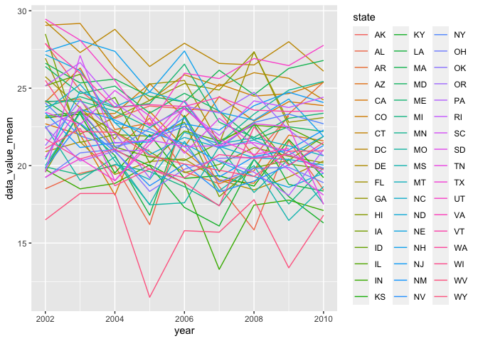
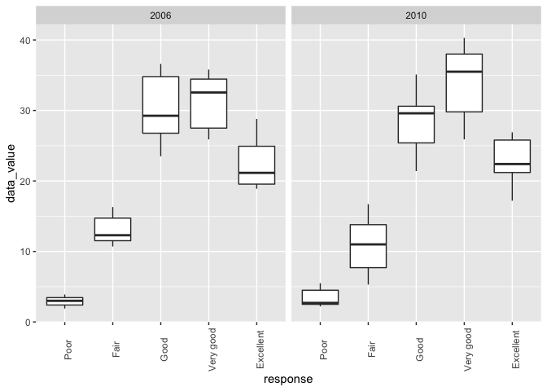
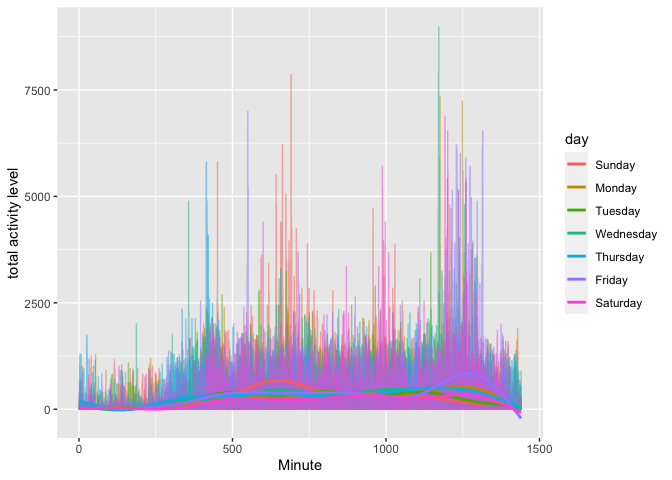

P8105\_HW3\_zc2555
================
Ziyu Chen
10/18/2021

*r setup & loading packages*

``` r
library(p8105.datasets)
data("instacart")
library(tidyverse)
```

    ## ── Attaching packages ─────────────────────────────────────── tidyverse 1.3.1 ──

    ## ✓ ggplot2 3.3.5     ✓ purrr   0.3.4
    ## ✓ tibble  3.1.4     ✓ dplyr   1.0.7
    ## ✓ tidyr   1.1.3     ✓ stringr 1.4.0
    ## ✓ readr   2.0.1     ✓ forcats 0.5.1

    ## ── Conflicts ────────────────────────────────────────── tidyverse_conflicts() ──
    ## x dplyr::filter() masks stats::filter()
    ## x dplyr::lag()    masks stats::lag()

``` r
library(ggplot2)
library(dplyr)
```

\#Problem 1

*Q1: How many aisles are there, and which aisles are the most items
ordered from?*

``` r
aisles_count =
  instacart %>%
  count(aisle, sort=TRUE)

aisles_count
```

    ## # A tibble: 134 × 2
    ##    aisle                              n
    ##    <chr>                          <int>
    ##  1 fresh vegetables              150609
    ##  2 fresh fruits                  150473
    ##  3 packaged vegetables fruits     78493
    ##  4 yogurt                         55240
    ##  5 packaged cheese                41699
    ##  6 water seltzer sparkling water  36617
    ##  7 milk                           32644
    ##  8 chips pretzels                 31269
    ##  9 soy lactosefree                26240
    ## 10 bread                          23635
    ## # … with 124 more rows

There are 134 aisles in the instacart dataset, fresh vegatables have the
most times, which is 150609.

*Q2: Make a plot that shows the number of items ordered in each aisle,
limiting this to aisles with more than 10000 items ordered. Arrange
aisles sensibly, and organize your plot so others can read it*

``` r
aisle_count = instacart %>%
  count(aisle,sort=TRUE) %>%
  filter(n>10000)

ggplot(aisle_count,aes(x=reorder(aisle, -n),y=n))+
  geom_bar(stat='identity')+
  theme(axis.text.x = element_text(angle = 90, vjust = 0.5, hjust=1))+
  labs(title="Count of aisles")+
  xlab("Aisles")+
  ylab("Order Count")
```

<!-- -->

The top three aisles are fresh vegetables, fresh furit and packaged
vegetables fruit.

*Q3: Make a table showing the three most popular items*

``` r
instacart %>%
  filter(aisle %in% c("baking ingredients", "dog food care", "packaged vegetables fruits")) %>%
  group_by(aisle, product_name) %>%
  summarise(
    product_count = n()) %>%
  mutate(
    product_rank = min_rank(-product_count)) %>%
  filter(product_rank <=3) %>%
  select(-product_rank) %>%
  knitr::kable()
```

    ## `summarise()` has grouped output by 'aisle'. You can override using the `.groups` argument.

| aisle                      | product\_name                                 | product\_count |
|:---------------------------|:----------------------------------------------|---------------:|
| baking ingredients         | Cane Sugar                                    |            336 |
| baking ingredients         | Light Brown Sugar                             |            499 |
| baking ingredients         | Pure Baking Soda                              |            387 |
| dog food care              | Organix Chicken & Brown Rice Recipe           |             28 |
| dog food care              | Small Dog Biscuits                            |             26 |
| dog food care              | Snack Sticks Chicken & Rice Recipe Dog Treats |             30 |
| packaged vegetables fruits | Organic Baby Spinach                          |           9784 |
| packaged vegetables fruits | Organic Blueberries                           |           4966 |
| packaged vegetables fruits | Organic Raspberries                           |           5546 |

The table above shows three most popular items in each of the aisles
“baking ingredients”, “dog food care”, and “packaged vegetables fruits”
with number of times each product be ordered.

*Q4: make a Make a table showing the mean hour of the day at which Pink
Lady Apples and Coffee Ice Cream are ordered on each day of the week;
format this table for human readers (i.e. produce a 2 x 7 table*

``` r
mean_hour=
instacart %>%
  filter(product_name %in% c("Pink Lady Apples", "Coffee Ice Cream")) %>%
   group_by (product_name, order_dow) %>%
   summarise(mean_hour = mean(order_hour_of_day)) %>%
   pivot_wider(names_from =order_dow, values_from =mean_hour) 
```

    ## `summarise()` has grouped output by 'product_name'. You can override using the `.groups` argument.

``` r
colnames(mean_hour)=c('', 'Sun', 'Mon', 'Tue', 'Wed', 'Thu', 'Fri', 'Sat')

mean_hour %>%
   knitr::kable()
```

|                  |      Sun |      Mon |      Tue |      Wed |      Thu |      Fri |      Sat |
|:-----------------|---------:|---------:|---------:|---------:|---------:|---------:|---------:|
| Coffee Ice Cream | 13.77419 | 14.31579 | 15.38095 | 15.31818 | 15.21739 | 12.26316 | 13.83333 |
| Pink Lady Apples | 13.44118 | 11.36000 | 11.70213 | 14.25000 | 11.55172 | 12.78431 | 11.93750 |

This 2\*7 table shows the mean hour of the day at which Pink Lady Apples
and Coffee Ice Cream are ordered on each day of the week.

\#Problem 2

*load the data*

``` r
library(p8105.datasets)
data("brfss_smart2010")
```

*First, do some data cleaning*

``` r
brfss=brfss_smart2010 %>%
  janitor::clean_names()%>%
  rename(state = locationabbr,
         county = locationdesc) %>%
  filter(topic == "Overall Health", response %in% c("Poor", "Fair", 'Good', 'Very good',"Excellent")) %>%  
   distinct() %>% 
  mutate(response = factor(response, levels=c("Poor", "Fair", 'Good', 'Very good',"Excellent")))
```

The cleaned data contains 10625 obs and 23 variables.

*In 2002, which states were observed at 7 or more locations? What about
in 2010?*

``` r
brfss_2002= brfss %>%
  filter(year == 2002 | year ==2010) %>%
  group_by (year, state) %>%
  summarise(location_count= n_distinct(county))  %>%
  filter(location_count >=7)
```

    ## `summarise()` has grouped output by 'year'. You can override using the `.groups` argument.

``` r
brfss_2002
```

    ## # A tibble: 20 × 3
    ## # Groups:   year [2]
    ##     year state location_count
    ##    <int> <chr>          <int>
    ##  1  2002 CT                 7
    ##  2  2002 FL                 7
    ##  3  2002 MA                 8
    ##  4  2002 NC                 7
    ##  5  2002 NJ                 8
    ##  6  2002 PA                10
    ##  7  2010 CA                12
    ##  8  2010 CO                 7
    ##  9  2010 FL                41
    ## 10  2010 MA                 9
    ## 11  2010 MD                12
    ## 12  2010 NC                12
    ## 13  2010 NE                10
    ## 14  2010 NJ                19
    ## 15  2010 NY                 9
    ## 16  2010 OH                 8
    ## 17  2010 PA                 7
    ## 18  2010 SC                 7
    ## 19  2010 TX                16
    ## 20  2010 WA                10

In 2002, 6 states were observed at 7 or more locations. They are
Connecticut, Florida, Massachusetts, North Carolina, New Jersey, and
Pennsylvania.

n 2010, 14 states were observed at 7 or more locations. They are
California, Colorado, Florida, Florida, Massachusetts, Maryland, North
Carolina, Nebraska, New Jersey, New York, Ohio, Pennsylvania, South
Carolina, Texas and Washington.

*Make a “spaghetti” plot*

``` r
brfss_excellent = brfss %>%
  filter(response == "Excellent")%>%
  mutate(data_value_sum = sample_size*data_value) %>% 
  group_by(year, state) %>%
  summarise(data_value_mean = mean(data_value)) %>% 
    select(year, state,  data_value_mean)
```

    ## `summarise()` has grouped output by 'year'. You can override using the `.groups` argument.

``` r
brfss_excellent %>%
  ggplot(aes(x = year, y = data_value_mean, group = state, color = state)) +
 geom_line()
```

    ## Warning: Removed 3 row(s) containing missing values (geom_path).

<!-- -->
Above is a “spaghetti” plot of average data value over time within a
state group by state. *Make a two-panel plot showing*

``` r
 brfss %>%
    filter(year == 2006 | year == 2010, 
         state == "NY") %>%
  select(year, state, response, data_value) %>%
  drop_na() %>% 
  ggplot(aes(x = response, y = data_value)) +
  geom_boxplot()+
  theme(axis.text.x = element_text(angle =90))+
   facet_grid(.~ year)
```

<!-- -->
Above is a two-panel plot showing for distribution of data\_value for
responses (“Poor” to “Excellent”) among locations in NY State in the
year 2006, and 2010,

\#Problem 3

*load the data*

``` r
accel_data = read_csv("accel_data.csv") %>%
  janitor::clean_names()%>%
 mutate(
    weekday_Weekend = ifelse(day_id %in% c(6,7), "Weekend", "Weekday"),
    week = as.integer(week),
    day_id = as.integer(day_id)
  ) %>%
  relocate (day_id, weekday_Weekend, day)
```

    ## Rows: 35 Columns: 1443

    ## ── Column specification ────────────────────────────────────────────────────────
    ## Delimiter: ","
    ## chr    (1): day
    ## dbl (1442): week, day_id, activity.1, activity.2, activity.3, activity.4, ac...

    ## 
    ## ℹ Use `spec()` to retrieve the full column specification for this data.
    ## ℹ Specify the column types or set `show_col_types = FALSE` to quiet this message.

The dataset has 35 obs and have 1444 variables. There are four date
variables : ‘day\_id’, ‘week’, ‘day\_id’, ‘day’ , ‘weekday\_end’(weekday
or weekend), and 1440 activities variables which count for each minute
of a 24-hour day starting at midnight. Each row is one day, and column
activity\_1:activity\_1440 counts for each minute of a 24-hour day
starting at midnight. Weekday\_weekend variable is created to indicate
whether the day is weekday or weekend.

*aggregate minites per day*

``` r
accel_data_day = accel_data %>%
  mutate(activity_sum = rowSums(across(activity_1:activity_1440))) %>% 
  select (  week, day, activity_sum) %>% 
  pivot_wider(names_from = day, values_from = activity_sum )%>% 
  select (week, Monday, Tuesday, Wednesday, Thursday, Friday, Saturday, Sunday)
accel_data_day  %>%
knitr::kable()
```

| week |    Monday |  Tuesday | Wednesday | Thursday |   Friday | Saturday | Sunday |
|-----:|----------:|---------:|----------:|---------:|---------:|---------:|-------:|
|    1 |  78828.07 | 307094.2 |    340115 | 355923.6 | 480542.6 |   376254 | 631105 |
|    2 | 295431.00 | 423245.0 |    440962 | 474048.0 | 568839.0 |   607175 | 422018 |
|    3 | 685910.00 | 381507.0 |    468869 | 371230.0 | 467420.0 |   382928 | 467052 |
|    4 | 409450.00 | 319568.0 |    434460 | 340291.0 | 154049.0 |     1440 | 260617 |
|    5 | 389080.00 | 367824.0 |    445366 | 549658.0 | 620860.0 |     1440 | 138421 |

From the table,we can see that the among weekdays, monday the activity
levels are usually not high, while Wednesday and thursday are higher, on
weekends, the activity level usually drops

*24 activity time for each day*

``` r
accel_each_day = accel_data %>%
  select(week, day, activity_1:activity_1440, day_id)%>%
 pivot_longer(
    activity_1:activity_1440,
    names_to = "activity_time",
    values_to = "activity"
  ) %>%
  separate(activity_time, c(NA, 'activity_time'), sep = '_') %>%
  mutate(
    activity_time = as.integer(activity_time),
    day = factor(day, levels = c('Sunday', 'Monday', 'Tuesday', 'Wednesday', 'Thursday','Friday', 'Saturday'))) 

accel_each_day  %>%
  ggplot(aes(x = activity_time, y = activity, color = day, se=FALSE)) +
  geom_line (alpha = 0.5) +
  geom_smooth(aes(group=day), se = FALSE)+
  ylab ("total activity level")+
  xlab("Minute")
```

    ## `geom_smooth()` using method = 'gam' and formula 'y ~ s(x, bs = "cs")'

<!-- -->
The x axis represents the minutes in one day, from 00:00 to 24:00 in
minutes, we can see that the aggregate activity levels for each weekdays
across 5 week has similar trends, as they have low activity level from
24:00 to the morning, indicating they might be sleeping. After around
500 minites (around 8 am), the activity level rises, indicating this
person might get up to do something else
